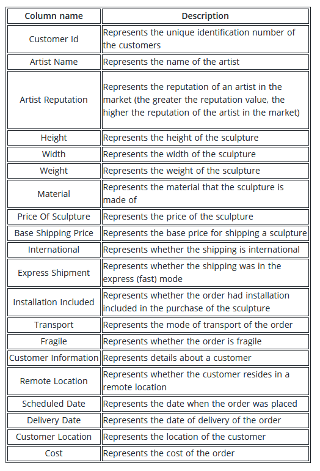

Problem statement

An art exhibitor is soon to launch an online portal for enthusiasts worldwide to start collecting art with only a click of a button. However, navigating the logistics of selling and distributing art does not seem to be a very straightforward task; such as acquiring art effectively and shipping these artifacts to their respective destinations post-purchase.

Task

The exhibitor has hired you as a Machine Learning Engineer for this project. You are required to build an advanced model that predicts the cost of shipping paintings, antiques, sculptures, and other collectibles to customers based on the information provided in the dataset.

Dataset

The dataset consists of parameters such as the artist’s name and reputation, dimensions, material, and price of the collectible, shipping details such as the customer information, scheduled dispatch, delivery dates, and so on.

Data description

The dataset folder contains the following files:

    train.csv: 6500 x 20
    test.csv: 3500 x 19
    sample_submission.csv: 5 x 2

The columns provided in the dataset are as follows:

https://www.hackerearth.com/challenges/competitive/hackerearth-machine-learning-challenge-predict-shipping-cost/

#### Result
Model Acc : 90.17
